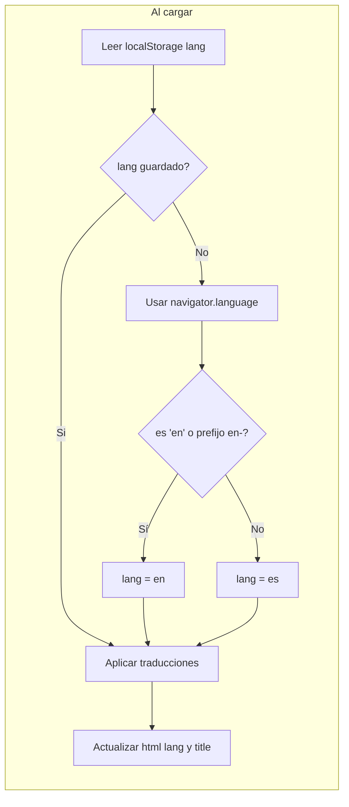

# Plan: Internacionalización ES/EN en Listen Thread

## Alcance

- **Idiomas:** Castellano (actual) y inglés.
- **Detección:** Automática desde el navegador (`navigator.language` / `navigator.languages`).
- **Respaldo:** Selector manual de idioma (ES | EN) visible en la UI.
- **Persistencia:** Preferencia guardada en `localStorage` para visitas posteriores.
- **Recursos:** Solo cambios en el frontend (archivo [public/index.html](public/index.html)); el backend no se modifica para no añadir carga en servidor (2 CPU, 1GB RAM).

## Enfoque técnico (ligero, sin build)

- Sin frameworks ni librerías de i18n: un objeto de traducciones en JavaScript dentro del mismo HTML.
- Sin build ni paso de compilación: todo en el HTML actual.
- Lógica en el cliente: al cargar la página se aplica el idioma y se rellenan todos los textos; el selector solo cambia de idioma y vuelve a aplicar.

## Flujo de idioma

- **Prioridad:** 1) `localStorage` (clave ej. `listen-thread-lang`), 2) idioma del navegador, 3) defecto `es`.
- **Criterio navegador:** Si `navigator.language` (o el primer valor de `navigator.languages`) empieza por `en`, usar inglés; en caso contrario, castellano.

## Cambios en [public/index.html](public/index.html)

### 1. Objeto de traducciones

Añadir un objeto `translations` con claves por idioma (`es`, `en`) y, para cada uno, las cadenas que hoy están fijas en el HTML y en el script, por ejemplo:

- Título de página, subtítulo, labels, placeholders, títulos de botones (Limpiar URL, Pegar, Convertir a Audio).
- Opciones del select (Masculino, Femenino).
- Mensajes de estado: validación URL, "Procesando hilo…", éxito, errores (incl. pegar portapapeles).
- Sección "Audio Generado" y textos de info (Tweets procesados, Chunks de audio).
- Bloque de ejemplo (Ejemplo de URL válida, nota sobre x.com).

Incluir también **mapeo de errores del API** (solo frontend): el backend sigue devolviendo mensajes en inglés; en el cliente, si `data.error` coincide con los mensajes conocidos (`Tweet URL is required`, `Invalid X URL (only x.com is accepted)`, `No tweets found in thread`, `Failed to process thread`, y si aplica el mensaje del rate limit), mostrar la cadena traducida correspondiente; si no hay coincidencia, mostrar `data.error` o `error.message` tal cual.

### 2. Selector de idioma

- Añadir en la parte superior del `.container` (por ejemplo, a la derecha del título o en una barra superior) un selector discreto: dos enlaces o botones "ES" y "EN" (o "Español" / "English").
- Al hacer clic: guardar en `localStorage`, actualizar variable de idioma, re-aplicar traducciones y actualizar `document.documentElement.lang` y `document.title`.

### 3. Atributos y elementos traducibles

- Mantener `<html lang="es">` como valor por defecto y actualizarlo en JS a `es` o `en` según el idioma elegido.
- Los textos que hoy están en el HTML pasan a estar en el objeto de traducciones; en el HTML se pueden dejar placeholders vacíos o el valor por defecto en español, y al cargar (y al cambiar idioma) un único script rellena:
  - Título de la página.
  - Subtítulo, labels, placeholder del input, `title` de los botones de limpiar/pegar.
  - Opciones del select (texto visible; `value` sigue siendo `male`/`female`).
  - Texto del botón "Convertir a Audio".
  - Título "Audio Generado" y etiquetas de la caja de info.
  - Texto del bloque de ejemplo.

### 4. Script existente

- Añadir al inicio del `<script>`:
  - Función `getInitialLang()`: leer `localStorage`; si no hay valor, inspeccionar `navigator.language` (o `navigator.languages[0]`) y devolver `'en'` o `'es'`.
  - Variable global (ej. `currentLang`) y función `setLanguage(lang)` que guarde en `localStorage`, actualice `currentLang`, llame a `applyTranslations()` y actualice `document.documentElement.lang` y `document.title`.
  - Función `applyTranslations()` que, usando `translations[currentLang]`, asigne cada cadena a su elemento (por `id`, `data-i18n` o clase convenida).
- En `convertThread()` y en el manejo de errores: usar claves del objeto de traducciones para mensajes generados en el cliente (p. ej. "Por favor ingresa una URL válida", "Procesando hilo…", "¡Conversión exitosa!", "Error al pegar…") y para el mapeo de errores del API descrito arriba.
- Asegurar que `applyTranslations()` se ejecute al cargar la página (por ejemplo al final del script o con `DOMContentLoaded`).

### 5. Estilo del selector

- Añadir estilos mínimos para el selector de idioma (enlace o botón pequeño, alineado a la derecha o debajo del título) para que sea visible pero no domine la interfaz.

## Resumen de textos a traducir

| Ubicación   | ES (actual)                                                       | EN                                                              |
| ----------- | ----------------------------------------------------------------- | --------------------------------------------------------------- |
| Title       | Listen Thread - X Thread to Speech                                | (mantener o "X Thread to Speech")                               |
| Subtitle    | Convierte hilos de X a audio                                      | Convert X threads to audio                                      |
| Label URL   | URL del hilo en X:                                                | Thread URL on X:                                                |
| Placeholder | https://x.com/usuario/status/...                                  | (igual)                                                         |
| Botones     | Limpiar URL, Pegar…, Convertir a Audio                            | Clear URL, Paste…, Convert to Audio                             |
| Género      | Masculino / Femenino                                              | Male / Female                                                   |
| Estados     | Procesando hilo…, ¡Conversión exitosa!, etc.                      | Processing…, Success!, etc.                                    |
| Errores API | Mapeo en cliente de los 4–5 mensajes del backend                 | (backend sigue en inglés; cliente muestra EN o ES según idioma) |
| Ejemplo     | Ejemplo de URL válida…                                            | Valid URL example…                                              |

## Qué no se hace (para mantener recursos limitados)

- No se añaden dependencias npm ni proceso de build.
- No se modifica el backend: no se envían cabeceras `Accept-Language` ni se devuelven mensajes traducidos desde el servidor; la traducción de errores del API es solo en el cliente mediante mapeo de los mensajes conocidos.
- No se usan archivos externos de idioma (todo en un solo objeto dentro de `index.html`).

## Orden sugerido de implementación

1. Definir el objeto `translations` (es/en) con todas las cadenas y el mapeo de errores del API.
2. Implementar `getInitialLang()`, `setLanguage()` y `applyTranslations()` y enganchar la aplicación de idioma al cargar la página.
3. Sustituir en el HTML los textos fijos por contenedores identificados (id o data-i18n) y hacer que `applyTranslations()` los rellene.
4. Añadir el selector ES/EN en la UI y conectarlo a `setLanguage()`.
5. Refactorizar `convertThread()` y el manejo de errores para usar las claves de `translations` y el mapeo de errores del API.
6. Ajustar estilos del selector y probar en navegador con idioma en español e inglés y con el selector manual.
