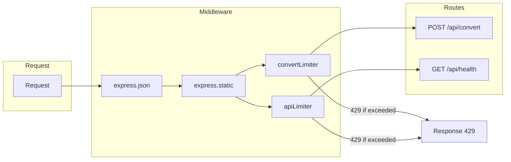

# Plan: Rate limiting

## Estado actual

En [index.js](index.js) ya está implementado:

- **convertLimiter**: 5 peticiones por IP cada 15 minutos en `POST /api/convert`.
- **apiLimiter**: 100 peticiones por IP cada 15 minutos en `GET /api/health`.
- `trust proxy` en 1 para detectar bien la IP detrás de proxy/nginx.
- Cabeceras estándar de rate limit (`RateLimit-*`) activadas.

Rutas sin límite explícito: `GET /`, archivos estáticos (`/public`, `/audio`). El riesgo principal es el abuso de `/api/convert` (scraping + TTS costoso), que ya está limitado.

---

## Objetivos del plan

1. Hacer los límites **configurables por entorno** (`.env` / `DOTENV_CONTENT`) sin romper valores por defecto actuales.
2. **Documentar** variables, comportamiento y cabeceras en DEPLOYMENT y ARCHITECTURE.
3. Opcional: límite suave para rutas no API (p. ej. `GET /`) si se quiere proteger frente a tráfico bruto.

No se incluye en este plan: store externo (Redis) ni límites por usuario/API key; se deja por IP en memoria.

---

## Cambios propuestos

### 1. Variables de entorno para rate limit

Definir en `.env` (y en el secret `DOTENV_CONTENT` en producción) variables opcionales, por ejemplo:

| Variable | Descripción | Por defecto |
|----------|-------------|-------------|
| `RATE_LIMIT_CONVERT_MAX` | Máximo de peticiones por ventana en `/api/convert` | 5 |
| `RATE_LIMIT_CONVERT_WINDOW_MS` | Ventana en ms para convert | 900000 (15 min) |
| `RATE_LIMIT_API_MAX` | Máximo para resto de API (p. ej. health) | 100 |
| `RATE_LIMIT_API_WINDOW_MS` | Ventana en ms para API | 900000 (15 min) |

En [index.js](index.js):

- Leer estas variables con `process.env` y `parseInt(..., 10)`, usando los valores por defecto anteriores si no están definidas o son inválidas.
- Construir `convertLimiter` y `apiLimiter` con esos valores (windowMs, max).
- Mantener `message`, `standardHeaders: true`, `legacyHeaders: false` y el orden actual de middlewares.

### 2. Respuesta 429 y mensaje consistente

- Asegurar que al superar el límite se responda con **429** y un JSON claro, por ejemplo:  
  `{ "error": "Too many requests", "retryAfter": 900 }` (o el valor real de la ventana en segundos si la librería lo expone).
- `express-rate-limit` ya devuelve 429 por defecto; verificar que el `message` que se pasa al limiter sea el cuerpo JSON deseado o usar un handler `handler` que envíe el JSON y `retryAfter` si se quiere.

### 3. Límite opcional para rutas no API (opcional)

- Si se desea proteger también el tráfico a `GET /` y estáticos, añadir un limiter global más permisivo (p. ej. 200 req/15 min por IP) y aplicarlo con `app.use(globalLimiter)` **después** de `express.static`, de modo que solo afecte a rutas no estáticas, o aplicarlo antes de las rutas dinámicas.  
- Dejar esto como **opcional** en el plan: se puede implementar en una segunda iteración para no sobrecomplicar el primer paso.

### 4. Documentación

- **[DEPLOYMENT.md](DEPLOYMENT.md)**  
  - En la sección "Environment Variables", añadir una subsección "Rate limiting" con la tabla de variables (`RATE_LIMIT_CONVERT_MAX`, etc.) y valores por defecto.  
  - En "Security", mencionar que el rate limiting está activo y que en producción puede ajustarse por entorno.

- **[ARCHITECTURE.md](ARCHITECTURE.md)**  
  - En "Scalability Considerations" / "Improvement Opportunities", actualizar el punto "Rate Limiting" para indicar que está implementado (por IP, configurable por env) y que mejoras futuras podrían ser store en Redis o límites por usuario.  
  - Opcional: una línea en "Security Measures" indicando rate limiting por IP en `/api/convert` y en endpoints API.

### 5. No tocar (por este plan)

- Store en memoria: suficiente para una sola instancia (PM2 con una instancia). Redis o store distribuido quedaría para un plan de escalado horizontal.
- No añadir dependencias nuevas; seguir usando solo `express-rate-limit`.

---

## Orden de implementación sugerido

1. Añadir lectura de variables de entorno y construcción de limiters en [index.js](index.js), manteniendo los mismos valores por defecto que ahora.
2. Ajustar respuesta 429 (mensaje JSON y, si se quiere, `retryAfter`).
3. Actualizar [DEPLOYMENT.md](DEPLOYMENT.md) (env vars + seguridad).
4. Actualizar [ARCHITECTURE.md](ARCHITECTURE.md) (rate limiting ya implementado y configurable).
5. (Opcional) Limiter global suave para `GET /` en una segunda iteración.

---

## Diagrama de flujo (rate limit actual)

Con los cambios, los valores de `CONV` y `API` (max, windowMs) pasan a ser configurables vía `.env`.
